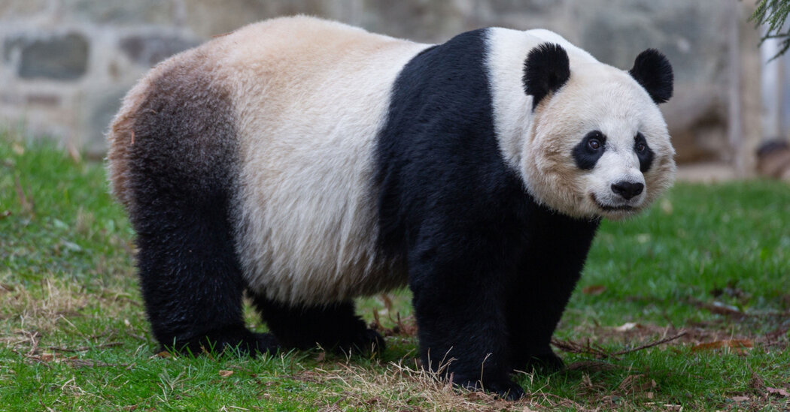

# Josh's GitHub Pages Website

Hi, my name is Joshua Kuschner, and this website contains a description of who I am as a programmer and as a person. If you want some more detail, check out my other [website](jkuschner.dev).

## Programming

I initally began my programming adventure in high school when I took AP Computer Science. We did all of our progamming in **Java** for that class, and the only thing we did whole year was solve coding puzzles. Since it was an intro level class, I thought that it was pretty easy. Also, since it was my only exposure to computer science, I naturally thought that all of it was going to be easy.

Lao Tzu:
> There is no greater danger than underesitmating your opponent.

Since then I have tackled a few challenging programming projects, so I have a better sense of what it takes to be a programmer. I think the hardest thing I've had to do so far was create a Huffman encoder to do *variable length compression* on text files.

## Some other stuff about me

Outside of programming, I have a few other hobbies.

My Hobbies:
- Cooking
- Video Games
- Board Games
- Cat Care
- Tennis

Also my favorite animal is the Giant Panda.

